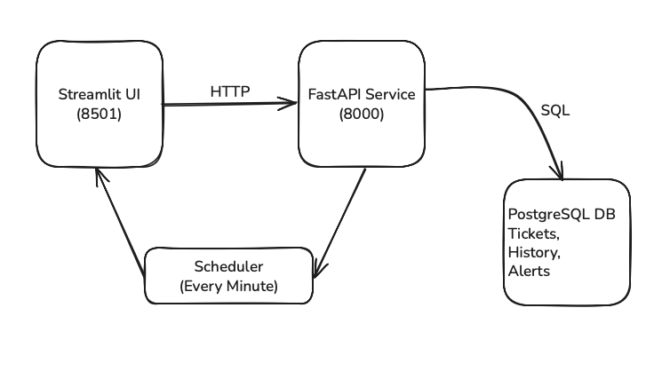

# SLA Monitoring Service

A **service** for real-time SLA (Service-Level Agreement) monitoring of customer support tickets, featuring:

- **Ticket ingestion** via FastAPI with idempotent upsert logic  
- **PostgreSQL persistence** of tickets, status history, and alert/breach events  
- **Background scheduler** that raises alerts (≤15% remaining) and breaches (≤0s) on response & resolution clocks  
- **Streamlit dashboard** for ticket management and SLA visibility  
- **Hot-reload** of SLA thresholds from `sla_config.yaml` using Watchdog  


## Table of Contents

- [Prerequisites](#prerequisites)  
- [Installation & Run](#installation--run)  
- [Usage](#usage)  
  - [Ingest Tickets](#ingest-tickets)  
  - [Dashboard](#dashboard)  
- [Configuration](#configuration)  
- [Architecture](#architecture)  
- [Design Document](#design-document)  
- [Next Steps & Improvements](#next-steps--improvements)  


## Prerequisites

- Docker & Docker Compose  
- (Optional) Python 3.10+ for local development  


## Installation & Run

1. **Clone the repository**  
   ```bash
   git clone <repo-url>
   cd 1_sla_monitoring
2. **Build and launch services**
   ```bash
   docker compose down --volumes --remove-orphans
   docker compose up --build -d
3. **Stop services**
   docker-compose down


## Usage

1. **Ingest Tickets**
- Via Streamlit UI: Open http://localhost:8501 and use the sidebar form
- Via API:
   ```bash
   curl -X POST http://localhost:8000/tickets \
  -H "Content-Type: application/json" \
  -d '[{
        "id": "ticket-123",
        "priority": "high",
        "customer_tier": "gold",
        "created_at": "2025-06-24T09:00:00Z",
        "updated_at": "2025-06-24T09:00:00Z",
        "status": "open"
    }]'

## Dashboard
- Navigate to http://localhost:8501 to:
- Create and ingest new tickets
- View current alerts and breaches with color indicators
- Browse ticket history and status‐change events

## Configuration
- Modify SLA thresholds in sla_config.yaml:

low:
  silver:
    response: 7200    # seconds
    resolution: 86400
  gold:
    response: 3600
    resolution: 43200
high:
  silver:
    response: 1800
    resolution: 21600
  gold:
    response: 900
    resolution: 10800
- The service hot-reloads this file at runtime without a restart.

## Architecture

- Streamlit: Interactive UI for ticket creation & SLA overview
- FastAPI:
    - POST /tickets to ingest/upsert tickets
    - APScheduler job checks SLAs every minute and records alerts/breaches
- PostgreSQL: Stores tickets, history, and alert records

# Design Document

## Goals & Requirements
- Real-time SLA tracking with early warnings & breaches
- Persistent audit (ticket state, history, alerts)
- Simple, extensible UI and API

## Data Flow
- Client -> POST /tickets -> upsert in tickets, record history
- Scheduler -> compute remaining time -> record alerts and update tickets status/escalation
- UI/API -> fetch dashboard summary and display color-coded alerts/breaches

## Next Steps & Improvements
- WebSocket for real-time push updates
- Alembic for schema migrations
- Authentication & Authorization layer
- Cloud Deployment (AWS Fargate / GCP Cloud Run with managed RDS)