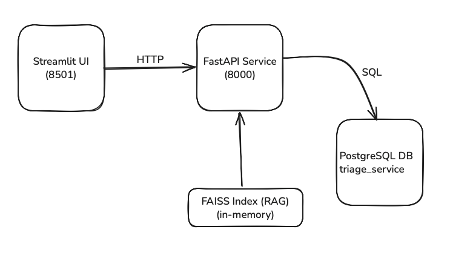

# Ticket Triage Service

## Overview

This repository implements Scenario II: Ticket Triage Service—a simple ticket classification and RAG-based answer system. Users can submit tickets via a REST API or an interactive Streamlit UI. The service classifies tickets into product areas and urgency levels, indexes documentation, and returns relevant snippets on user queries.

---

## Getting Started

1. **Prerequisites**

- Docker & Docker Compose installed
- (Optional) Python 3.10+ if you want to run locally without containers

2. **Clone the repo**
    ```bash
    git clone https://your-repo.git
    cd 2_ticket_triage

3. **Configuration**
- By default the service uses:
    - DATABASE_URL=postgresql://user:password@db:5432/triage_service
    - DATA_DIR=data/  
- You can override these in a config.py file in the project root:

4. **Build and Run**
- Bring up the database, FastAPI app, and Streamlit UI with Docker Compose:
    ```bash
    docker-compose up --build
- FastAPI runs on http://localhost:8000
    - /classify
    - /respond
- Streamlit UI runs on http://localhost:8501
- To tear everything down:
    ```bash
    docker-compose down

## Functional Requirements (FR)
1. **FR-1: REST Endpoints**
- /classify → POST { id, text } → 200 { id, product_area, urgency }
- /respond → POST { ticket_id, query } → 200 { answer, citations }

2. **FR-2: Document Ingestion**
- On startup, JSON files in data/ are loaded (supports single-object or array) and indexed in-memory via FAISS with embeddings from all-MiniLM-L6-v2.

3. **FR-3: RAG Pipeline**
- Queries are embedded, cosine-normalized, and a top-k search returns snippets and source URLs to build answers and citations.

4. **FR-4: Persistence**
- Classifications are saved to PostgreSQL (tickets table).
- Responses and stats (tokens in/out, retrieval latency) are saved in the responses table with a foreign key to tickets.

5. **FR-5: Containerization**
- A single docker-compose.yml spins up Postgres, the FastAPI app, and Streamlit UI via Docker Compose.

## Architecture


## Components
1. **FastAPI App (app/main.py)**
- Startup: wait for DB, create tables, ingest docs
- Endpoints: /classify, /respond

2. **Database**
- PostgreSQL with two tables (tickets, responses), managed via SQLAlchemy

3. **RAG Engine (app/rag.py)**
- Loads docs, builds FAISS index, answers queries

4. **Classifier (app/classifier.py)**
- Placeholder keyword/ML classifier ("CASB" vs. "General", "urgent" vs. "low")

5. **Streamlit UI (app/streamlit_app.py)**
- Sidebar for ticket submission and response retrieval

6. **Containerization**
- Dockerfile builds and runs FastAPI + Streamlit
- docker-compose.yml orchestrates db + app

## Design Document
1. **High-Level Design**
- Goal: Provide a scalable, containerized microservice that classifies tickets and surfaces relevant documentation snippets.
    - Service boundaries
        - Ticket Triage Service: FastAPI microservice
        - Data Store: Managed PostgreSQL
        - Vector Store: In-memory FAISS index
        - UI: Streamlit for interactive demos
    - Data flow
        - Classification
            - Client → POST /classify →
            - classify_ticket(text) →
            - Write to tickets table
            - Return classification JSON
        - Response
            - Client → POST /respond →
            - Verify ticket_id exists →
            - generate_response(query) →
            - Embed query → FAISS search → build answer & citations
            - Write to responses table
            - Return answer JSON
    - Technology choices
        - FastAPI for low-overhead REST
        - SQLAlchemy ORM for database
        - SentenceTransformers + FAISS for RAG
        - Streamlit for quick UI
        - Docker Compose for local dev & demo
2. **Low-Level Design**
    - Data Models
        ```sql
        -- tickets
        CREATE TABLE tickets (
        id TEXT PRIMARY KEY,
        text TEXT NOT NULL,
        product_area TEXT,
        urgency TEXT,
        created_at TIMESTAMP,
        classified_at TIMESTAMP
        );

        -- responses
        CREATE TABLE responses (
        id SERIAL PRIMARY KEY,
        ticket_id TEXT REFERENCES tickets(id),
        answer TEXT NOT NULL,
        citations JSON NOT NULL,
        llm_tokens_in INT,
        llm_tokens_out INT,
        retrieval_latency_ms INT,
        created_at TIMESTAMP
        );
    - API Schema
        - /classify
            - Request: { "id": "string", "text": "string" }
            - Response: { "id": "string", "product_area": "string", "urgency": "string" }
        - /respond
            - Request: { "ticket_id": "string", "query": "string" }
            - Response: { "answer": "string", "citations": [{ "source": "url", "snippet": "string" }]}
    - RAG Pipeline
        - Ingestion (startup)
            - Load JSON docs → normalize to list → extract url + content
            - Embed with all-MiniLM-L6-v2 → normalize L2 → build IndexFlatIP
        - Query (generate_response)
            - Embed & normalize query
            - index.search(q_emb, k=5) → distances + indices
            - Build answer by concatenating top snippets
            - Return citations & token/latency stats


## Next Steps
- FR-6 (IaC): add Terraform/CloudFormation scripts
- FR-7 (Metrics): instrument with Prometheus/Grafana